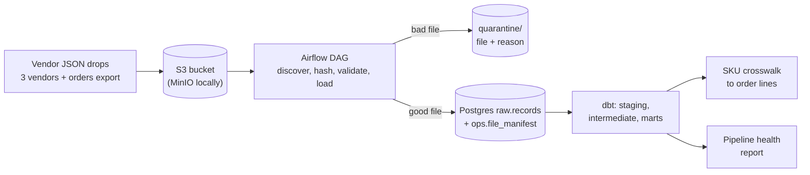

# Airflow ETL modernization: vendor JSON on S3 to Postgres with dbt

[](https://github.com/linus10x/sample-airflow-etl-modernization/actions/workflows/ci.yml)

An illustrative sample on synthetic retail data. Nothing in it comes from a real client, vendor or customer.

## The problem

> Our Python ETL loads vendor JSON files from S3, and it fails quietly whenever a vendor changes a field. We want the data in Postgres with tests, readable monitoring and safe re-runs.

That is a composite of requests I see often, not a quote from one client. The usual shape is a cron or Airflow job that nobody owns, three or four suppliers who each describe a product differently, and an analyst who finds out about a broken load when a number looks wrong.

## What this sample shows

- `legacy/legacy_etl.py` is the "before": a script that reads vendor and order JSON and writes CSV files. It skips files it cannot read and turns a missing field into a zero, which is how these jobs fail quietly. I kept it so the new pipeline can be compared with it.
- Two Airflow DAGs replace it. `ingest_vendor_files` loads three vendor catalogs and an orders export from S3 into Postgres. `transform` runs dbt and renders a health report.
- Every feed has a data contract (pydantic, versioned). A file that breaks its contract is copied to `quarantine/` with a plain-language reason, recorded in the manifest, and alerted. The other feeds in the same run still load.
- Loads are keyed by the checksum of the file. Re-running a day, or re-running the whole month, loads nothing twice. If a vendor sends a corrected file, it has a new checksum and loads.
- dbt builds staging, intermediate and mart models. The SKU crosswalk normalizes each vendor's product codes, applies a hand-made override list for retired codes, and keeps every order line, labelled `exact_normalized`, `manual_override` or `unmatched`.
- `make report` writes an HTML report from the `ops` and `marts` schemas: freshness by feed, row counts, rejected files with their reasons, and how many order lines tie to a product.
- A parity test runs the legacy script and the new pipeline on the same files and compares the order total of every order.

## Architecture



More diagrams, and what each schema holds, are in [docs/architecture.md](docs/architecture.md).

## Quick start

You need Docker with Compose v2, `make` and `git`. For the tests you also need Python 3.12.

```
make demo
```

That starts Postgres, MinIO and Airflow, generates the dataset, loads 30 days of files through Airflow with a backfill, builds the dbt models and writes the report. On my machine a clean run (volumes deleted, images already pulled) took about 4.5 minutes, most of it the 30 day backfill. The first run on a new machine adds the image pulls and the Airflow image build. When it finishes:

- Airflow UI: http://localhost:8080 (the login is in `.env.example`, a demo value for localhost only)
- Health report: `out/health_report.html`
- MinIO console: http://localhost:9001

In the Airflow grid, the run for 2026-03-05 shows the `ingest` task for `vendor_c` in red and the other three feeds green. That is the planted drift file described below.

Other targets: `make test` (unit and integration), `make test-dags`, `make test-e2e`, `make lint`, `make typecheck`, `make images`, `make pdf`, `make clean`.

## The planted drift

`scripts/generate.py --seed 42` writes 30 days of files for three vendors and an orders export: 800 products, 5,000 orders. On day 5 (2026-03-05) vendor_c sends `UnitCost` where its contract says `Cost`. That one file is the only file in the dataset that breaks a contract, and a test checks that. The reason recorded for it reads:

```
vendor_c contract v1: 240 of 240 rows missing required field 'Cost'
(unexpected fields: UnitCost), first at index 0
```

The legacy script reads the same file, finds no `Cost`, and writes 240 rows with a cost of 0 and no error.

## Tests and coverage

| Layer | What it covers | Where it runs |
|---|---|---|
| Unit | contracts (one test per rule), parsing, ingest, freshness, notifier, SKU normalization, report rendering, generator determinism | `make test-unit`, no services |
| Integration | the Postgres manifest (including a race between 8 workers loading one file, and rollback of a half-written file), S3 round trips, ingest and CLI against real services | `make test` |
| DAG integrity | every DAG imports once, no cycles, owner, tags and retries set, one mapped task per feed, the asset link, no database or S3 client imported at parse time | `make test-dags`, inside the Airflow image |
| dbt | unique, not_null, relationships and accepted_values on the key models, a custom test that fails if the crosswalk drops an order line, a custom test that fails if an unmatched line is not labelled, two dbt unit tests for the normalization macro, and a check that the macro agrees with the Python normalizer on a shared case file | part of `dbt build` |
| End to end | dbt on the loaded data, row counts against the generator, parity with the legacy script, negative controls that damage the marts and check the dbt gates fail, and the Airflow DAGs run in the container | `make test-e2e` |

CI enforces `--cov-fail-under=85` on the `pipeline` package. In the CI run for this release, 123 tests pass (100 unit and integration, 7 DAG integrity, 16 end to end) with 98.3% line coverage on the pipeline package, and all 39 dbt tests and unit tests pass.

I checked that the gates can fail by breaking them on purpose: removing the checksum guard, letting a bad file load, skipping the copy to quarantine, dropping the date check, and importing a database driver at the top of a DAG file. Each change turned a test red.

## Design decisions

- **Quarantine instead of failing the run.** A vendor's bad day should not hold back the other feeds. The vendor's own task still fails, so the problem is visible in the grid, and it is not retried because a broken contract will not fix itself. Connection errors are retried with exponential backoff.
- **The file checksum is the identity.** Not the file name and not the date. The same bytes are never loaded twice, a corrected resend loads, and the manifest insert is the gate, so two workers racing on one file cannot both load it.
- **Raw JSONB first, typing in dbt.** The raw table keeps exactly what arrived. A change to how a field is cast is a dbt change and a re-run, not a re-ingest.
- **BashOperator for dbt, not Cosmos.** One `dbt build`, readable logs, no extra provider to pin against Airflow. dbt lives in its own virtual environment in the image so its pins cannot disturb Airflow's.
- **Asset-aware scheduling.** `transform` is scheduled on the raw records asset that the ingest DAG publishes, not on a clock. Backfills use Airflow's own backfill command.
- **The crosswalk labels instead of dropping.** An order line that cannot be tied to a product stays in `fct_order_lines` as `unmatched` and shows up in the report.
- **Two implementations of SKU normalization, one set of test cases.** The Python function and the SQL macro read the same case file, so they cannot drift apart without a test failing.
- **The sample's DAG has an end date.** The synthetic files stop on 2026-03-30. Without an end date the scheduler would also run for today, find no file, and fail the freshness check. Remove it for live data.

## What this sample does not do

- It does not deploy anywhere. There is no cloud infrastructure, only Docker Compose on one machine.
- No streaming, no Spark, no BI tool. The report is a static HTML page.
- It does not use real vendor data. The three vendor formats and the drift event are my own invention, so the sample shows how the pipeline behaves, not how any particular vendor behaves.
- A quarantined file is not replayed automatically. The vendor (or you) puts a corrected file at the same path, and the next run loads it.
- The SKU crosswalk matches on normalized codes and a manual list. It does not guess. Order lines it cannot match stay unmatched and are counted.
- Freshness in the report is measured against the newest file in the manifest, because the sample's files are dated in the past.
- The Slack alert is a plain incoming webhook, set with `SLACK_WEBHOOK_URL`. It is tested against a fake endpoint, not a real workspace.
- Authentication on the local services is the demo setup in `.env.example`. It is not a hardened configuration.

## Versions

Python 3.12, Apache Airflow 3.3.2 (official image `apache/airflow:3.3.2-python3.12`), PostgreSQL 16, dbt-core 1.12.5 with dbt-postgres 1.11.0, pydantic 2, boto3, psycopg 3, pytest, ruff, mypy, Docker Compose v2. The MinIO image is Chainguard's build (`cgr.dev/chainguard/minio:latest`), because MinIO no longer publishes its own images on Docker Hub or Quay. Airflow 3.x worked with the providers used here, so there was no need to fall back to 2.10.

## Data sources and licenses

All data is generated by `scripts/generate.py` with seed 42. There are no third-party datasets. See [data/SOURCES.md](data/SOURCES.md). The code is licensed MIT OR Apache-2.0, at your option (`LICENSE-MIT`, `LICENSE-APACHE`).

---

Kunjar Bhaduri. I lead and deliver the work myself, using frontier AI tooling to move fast.
