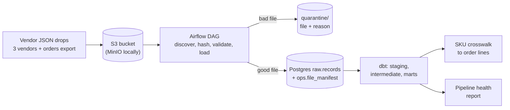
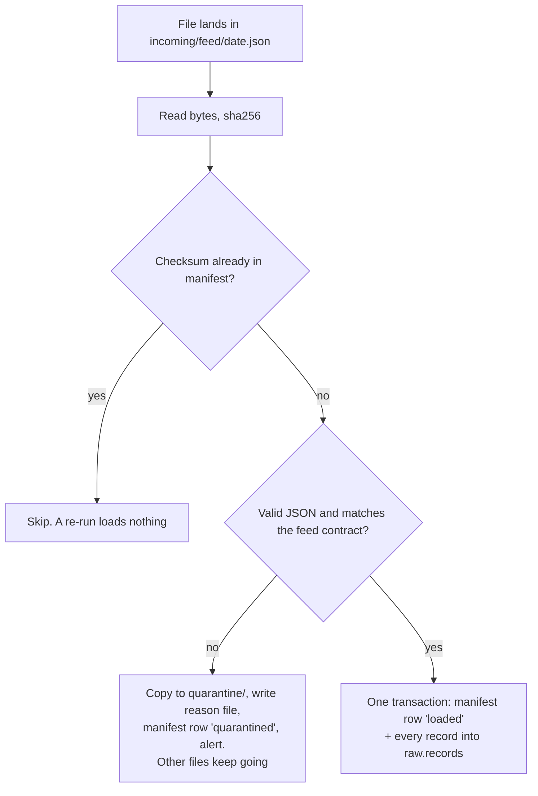
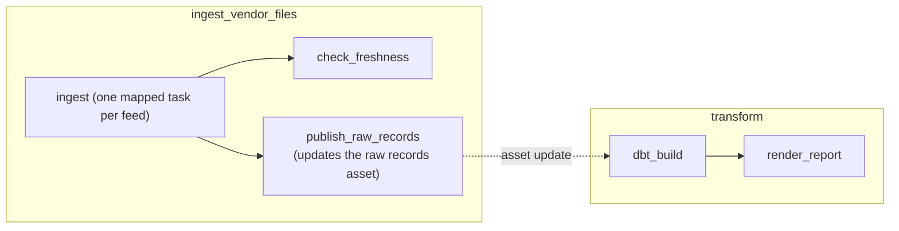

# Architecture

## Pipeline

## What happens to one file

## Airflow

## Warehouse layers

| Schema | Owner | Contents |
|---|---|---|
| `raw` | ingest DAG | `records`: one JSONB document per record, exactly as received |
| `ops` | ingest DAG | `file_manifest`: one row per distinct file content, loaded or quarantined, with the reason |
| `staging` | dbt | typed views per source; the newest loaded version of each day wins |
| `intermediate` | dbt | normalized order lines, latest vendor product snapshots |
| `marts` | dbt | `dim_products`, `crosswalk_sku`, `fct_order_lines`, `fct_orders`, `sku_match_summary` |
